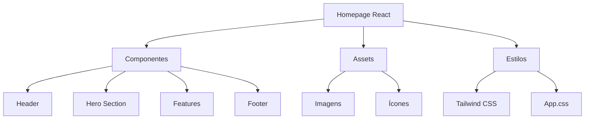
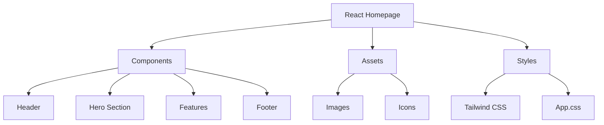

# Homepage Moderna com React

Uma homepage moderna e responsiva desenvolvida com React e Tailwind CSS, demonstrando as melhores práticas de desenvolvimento frontend e design contemporâneo. Este projeto apresenta uma interface elegante e interativa, ideal para portfólios pessoais ou empresariais.

## 🖼️ Imagem Hero


Uma representação visual da homepage moderna em ação, destacando o design responsivo e a interface interativa desenvolvida com React.

## ✨ Funcionalidades

- **Design Responsivo**: Interface que se adapta perfeitamente a todos os dispositivos.
- **Componentes Reutilizáveis**: Arquitetura modular com componentes React otimizados.
- **Performance Otimizada**: Carregamento rápido e experiência fluida do usuário.
- **Animações Suaves**: Transições e efeitos visuais modernos com `tw-animate-css`.
- **Acessibilidade**: Implementação seguindo padrões de acessibilidade web.

## 🚀 Tecnologias Utilizadas


- **React 18**: Biblioteca JavaScript para construção de interfaces de usuário.
- **Vite**: Ferramenta de build moderna e rápida para projetos frontend.
- **Tailwind CSS**: Framework CSS utilitário para design rápido e responsivo.
- **Lucide React**: Biblioteca de ícones para React.
- **JavaScript ES6+**: Funcionalidades modernas da linguagem.
- **HTML5**: Estrutura semântica e acessível.
- **CSS3**: Estilização avançada.

## 🏗️ Arquitetura do Projeto



## 🔧 Instalação e Execução

### Pré-requisitos
- Node.js (versão 16 ou superior)
- pnpm (gerenciador de pacotes)

### Passos para execução

1. **Clone o repositório:**
   ```bash
   git clone https://github.com/galafis/Criando-uma-Homepage-com-React.git
   cd Criando-uma-Homepage-com-React
   ```

2. **Instale as dependências:**
   ```bash
   pnpm install
   ```

3. **Execute o projeto em modo de desenvolvimento:**
   ```bash
   pnpm run dev
   ```

4. **Acesse no navegador:**
   ```
   http://localhost:5173
   ```

### Build para Produção

```bash
pnpm run build
```

Os arquivos otimizados serão gerados na pasta `dist/`.

## 📱 Demonstração Online

🌐 **[Ver Demonstração ao Vivo](https://galafis.github.io/Criando-uma-Homepage-com-React/)**

## 📁 Estrutura do Projeto

```
homepage-react/
├── public/
│   ├── favicon.ico
│   └── hero-image.png
├── src/
│   ├── assets/  # Static assets like images
│   ├── components/
│   │   ├── Header/
│   │   │   └── Header.jsx
│   │   ├── Hero/
│   │   │   └── Hero.jsx
│   │   ├── Features/
│   │   │   └── Features.jsx
│   │   └── Footer/
│   │       └── Footer.jsx
│   ├── App.css  # App-specific styles
│   ├── App.jsx  # Main App component
│   ├── index.css  # Global styles
│   └── main.jsx  # Entry point
├── components.json  # shadcn/ui configuration
├── eslint.config.js  # ESLint configuration
├── index.html  # HTML entry point
├── package.json  # Project dependencies and scripts
├── pnpm-lock.yaml  # Lock file for dependencies
└── vite.config.js  # Vite bundler configuration
```

## 🎨 Características de Design

### Paleta de Cores
- **Primary**: #2563eb (Azul moderno)
- **Secondary**: #64748b (Cinza elegante)
- **Accent**: #f59e0b (Dourado vibrante)
- **Background**: #ffffff (Branco limpo)

### Tipografia
- **Headings**: Inter, system-ui
- **Body**: -apple-system, BlinkMacSystemFont, Segoe UI

### Layout Responsivo
- **Desktop**: Grid layout com múltiplas colunas
- **Tablet**: Layout adaptado para telas médias
- **Mobile**: Stack vertical otimizado

## 🧪 Testes

Para executar os testes, utilize:

```bash
pnpm run test
```

## 🤝 Contribuição

Contribuições são sempre bem-vindas! Para contribuir:

1. Faça um fork do projeto
2. Crie uma branch para sua feature (`git checkout -b feature/AmazingFeature`)
3. Commit suas mudanças (`git commit -m 'Add some AmazingFeature'`)
4. Push para a branch (`git push origin feature/AmazingFeature`)
5. Abra um Pull Request

## 📄 Licença

Este projeto está sob a licença MIT. Veja o arquivo [LICENSE](LICENSE) para mais detalhes.

## ✒️ Autor

**Gabriel Demetrios Lafis**

- GitHub: [@galafis](https://github.com/galafis)
- LinkedIn: [Gabriel Demetrios Lafis](https://linkedin.com/in/gabriel-lafis)

---

# Modern Homepage with React

A modern and responsive homepage developed with React and Tailwind CSS, showcasing best practices in frontend development and contemporary design. This project features an elegant and interactive interface, ideal for personal or business portfolios.

## 🖼️ Hero Image


A visual representation of the modern homepage in action, highlighting the responsive design and interactive interface developed with React.

## ✨ Features

- **Responsive Design**: Interface that adapts perfectly to all devices.
- **Reusable Components**: Modular architecture with optimized React components.
- **Optimized Performance**: Fast loading and smooth user experience with the latest web technologies.
- **Smooth Animations**: Modern visual transitions and effects with `tw-animate-css`.
- **Accessibility**: Implementation following web accessibility standards for inclusivity.

## 🚀 Technologies Used


- **React 18**: JavaScript library for building user interfaces.
- **Vite**: Modern and fast build tool for frontend projects.
- **Tailwind CSS**: Utility-first CSS framework for rapid and responsive design.
- **Lucide React**: Icon library for React.
- **JavaScript ES6+**: Modern language features.
- **HTML5**: Semantic and accessible structure.
- **CSS3**: Advanced styling.

## 🏗️ Project Architecture



## 🔧 Installation and Execution

### Prerequisites
- Node.js (version 16 or higher)
- pnpm (package manager)

### Execution Steps

1. **Clone the repository:**
   ```bash
   git clone https://github.com/galafis/Criando-uma-Homepage-com-React.git
   cd Criando-uma-Homepage-com-React
   ```

2. **Install dependencies:**
   ```bash
   pnpm install
   ```

3. **Run the project in development mode:**
   ```bash
   pnpm run dev
   ```

4. **Access in browser:**
   ```
   http://localhost:5173
   ```

### Production Build

```bash
pnpm run build
```

Optimized files will be generated in the `dist/` folder.

## 📱 Online Demo

🌐 **[View Live Demo](https://galafis.github.io/Criando-uma-Homepage-com-React/)**

## 📁 Project Structure

```
homepage-react/
├── public/
│   ├── favicon.ico
│   └── hero-image.png
├── src/
│   ├── assets/  # Static assets like images
│   ├── components/
│   │   ├── Header/
│   │   │   └── Header.jsx
│   │   ├── Hero/
│   │   │   └── Hero.jsx
│   │   ├── Features/
│   │   │   └── Features.jsx
│   │   └── Footer/
│   │       └── Footer.jsx
│   ├── App.css  # App-specific styles
│   ├── App.jsx  # Main App component
│   ├── index.css  # Global styles
│   └── main.jsx  # Entry point
├── components.json  # shadcn/ui configuration
├── eslint.config.js  # ESLint configuration
├── index.html  # HTML entry point
├── package.json  # Project dependencies and scripts
├── pnpm-lock.yaml  # Lock file for dependencies
└── vite.config.js  # Vite bundler configuration
```

## 🎨 Design Features

### Color Palette
- **Primary**: #2563eb (Modern Blue)
- **Secondary**: #64748b (Elegant Gray)
- **Accent**: #f59e0b (Vibrant Gold)
- **Background**: #ffffff (Clean White)

### Typography
- **Headings**: Inter, system-ui
- **Body**: -apple-system, BlinkMacSystemFont, Segoe UI

### Responsive Layout
- **Desktop**: Multi-column grid layout
- **Tablet**: Adapted layout for medium screens
- **Mobile**: Optimized vertical stack

## 🧪 Testing

To run tests, use:

```bash
pnpm run test
```

## 🤝 Contribution

Contributions are always welcome! To contribute:

1. Fork the project
2. Create your feature branch (`git checkout -b feature/AmazingFeature`)
3. Commit your changes (`git commit -m 'Add some AmazingFeature'`)
4. Push to the branch (`git push origin feature/AmazingFeature`)
5. Open a Pull Request

## 📄 License

This project is licensed under the MIT License. See the [LICENSE](LICENSE) file for more details.

## ✒️ Author

**Gabriel Demetrios Lafis**

- GitHub: [@galafis](https://github.com/galafis)
- LinkedIn: [Gabriel Demetrios Lafis](https://linkedin.com/in/gabriel-lafis)

